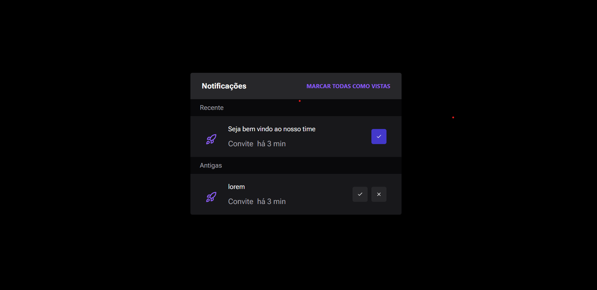

# Prova de Gerência de Configuração

## Widget

- Aplicação usando Nextjs
- Usando StoryBook 
- Usando tailwindcss

### Rodar o projeto

- primeiro instalar o nodejs versão LTS
- npm install para instalar todas as dependência
- npm run dev para executar o projeto 
- npm run storybook pra rodar storybook